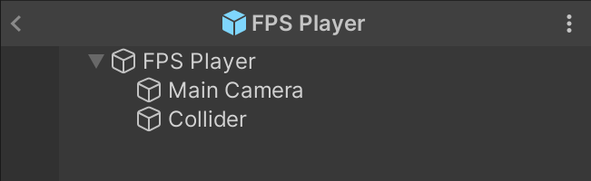

# Unity FPS Rigidbody Controller 
This is the controller to use if you want to create a **First Person** **rigidbody** controller in Unity. It is **responsive**, **smooth** and **simple** in design.

## Why is this controller better than others?
A great player controller must be two things:
1. Responsive
2. Smooth

Any controller that messes up either of these two things is not a good controller.

Most controllers using rigidbodies in Unity fail at either of these things and this is the reason this repository exists. Move to [this section](#why-do-most-controllers-fail) to understand why most controllers fail.

## How to use this controller?
1. Download the repository
2. Copy the assets over to your project
3. Add the `Player` prefab to your scene

## Documentation
### Player composition
The included *Player* prefab shows how to use both the `FPSMove` and `FPSLook` scripts. The `FPSMove` script is attached to the player object and the `FPSLook` script is attached to the camera object.

### FPSMove
The `FPSMove` script is responsible for moving the player. It is attached to the player object. 
> The speed and acceleration of the player **does not** depend on player *Rigidbody* mass. The mass of the player can however be changed to affect how the player interacts with other objects, i.e. how much the player can push/is pushed by other objects.
> 

### FPSLook
The `FPSLook` script is responsible for rotating the camera. It is attached to the camera object.
> The rotation of the camera is synced with the player rotation each `FixedUpdate()`. This is done to make the player movement smooth and the camera movement responsive.

## Why do most controllers fail?

For non-rigidbody controllers, these both come easily. Use `LateUpdate()` to do camera movement and `Update()` to do player movment. But for rigidbody controllers, it is not that simple. 

Rigidbodies are updated in `FixedUpdate()` which by default is called 50 times per second. If we naively use `FixedUpdate()` for player movement, the player will feel **choppy**, breaking the second rule. To fix this we change the `Interpolation` setting of the rigidbody to `Interpolate`. This makes the rigidbody move smoothly.

For interpolation to work, we must make sure to only rotate the player in `FixedUpdate()`. However a camera only updating in `FixedUpdate()` will feel **unresponsive**.

The final solution to this is what this controller does. It moves the player in `FixedUpdate()` and the camera rotates separately from the player in `LateUpdate()`. On `FixedUpdate()` in the player look script, we sync the camera rotation with the player rotation. This makes the player rigidbody movement smoothly interpolated, and allows for responsive camera movement.

Voila! We have a smooth and responsive player controller.